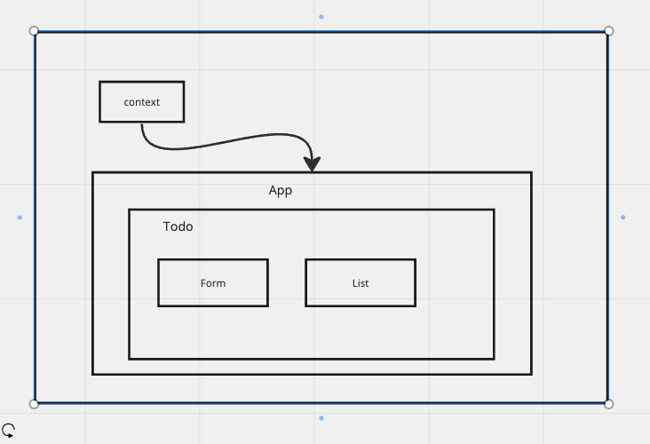
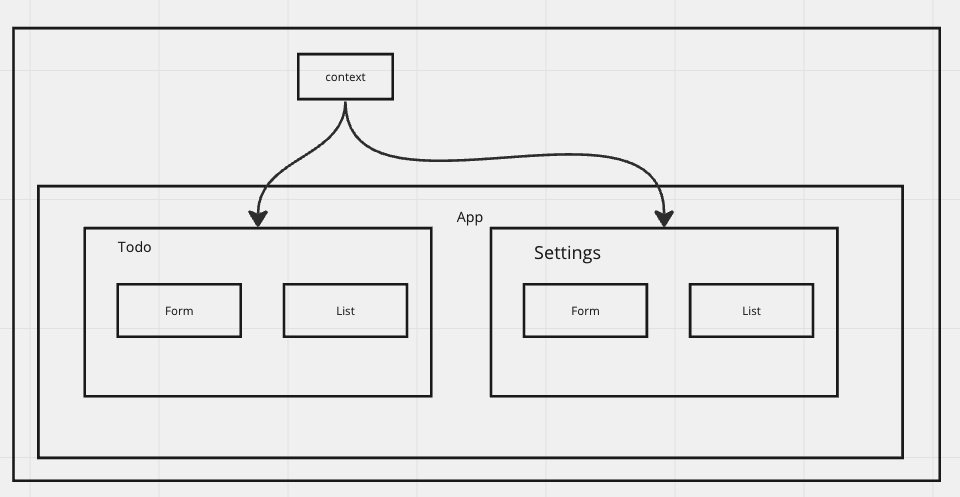

# Project: Todo-App

### Problem Domain  

Refactor an existing To Do App with Mantine Components, React Context API, and Pagination.

### Setup

#### How to initialize/run your application (where applicable)

- npm i to install dependencies
- npm start to open page

#### Features / Routes

Can access settings form via nav bar. Settings will be saved to local storage. Can choose to hide/show completed todos, how many per page, and set a sorting word.

Settings context is provided app-wide, but so far only consumed by Todo component where the core functionality of our app currently lives. Todo needs to know how many items to display, whether or not to display finished items, and if there is a non-standard sort order (difficulty). It uses this information from the settings context to determine how many pages there are to load for the Pagination component, and which items are display-worthy.

#### Tests

npm test

Unit tests for simple components and an integration test to test the more complicated ones (Todo, Pagination, List).

#### UML

Day 1 UML

Day 2 UML
